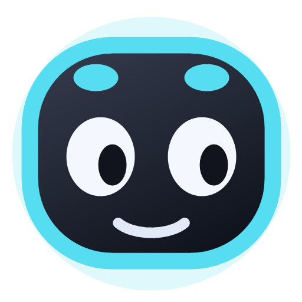
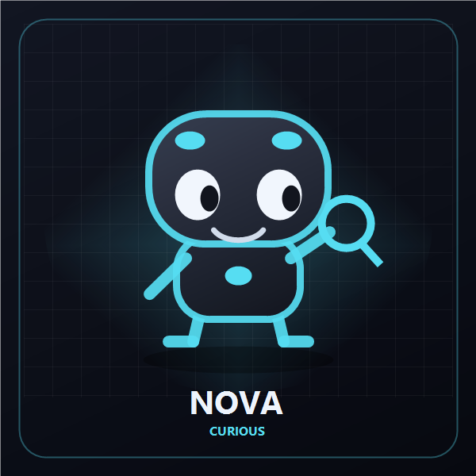
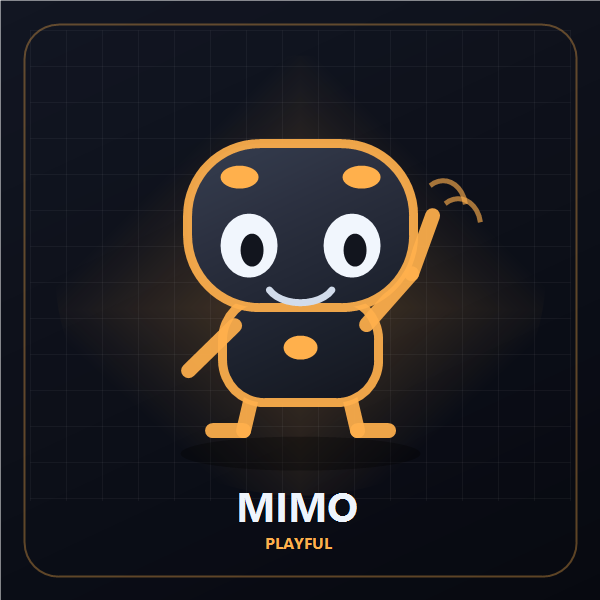
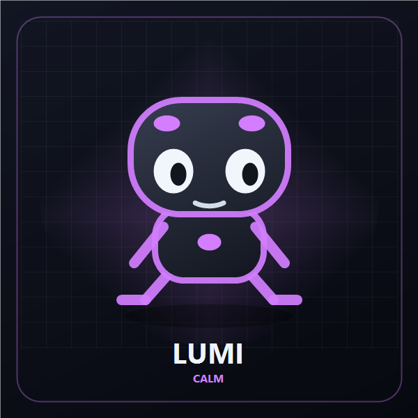
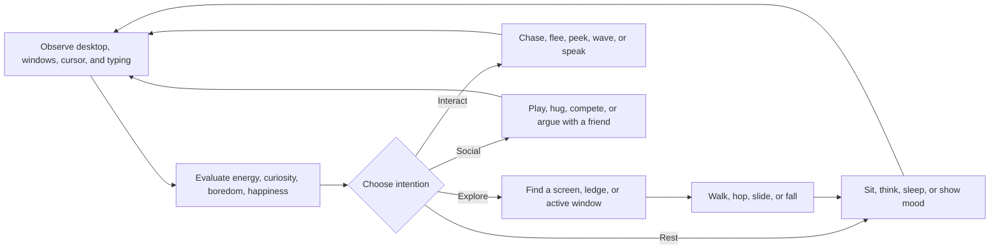

<div align="center">



# Nimvio

### Your curious desktop companions.

Nimvio walks across your Windows desktop, explores every monitor, finds places to sit, reacts to you and to each other, and develops its own rhythm through energy, curiosity, boredom, and happiness.

[](https://www.microsoft.com/windows)
[](https://dotnet.microsoft.com/)
[](https://learn.microsoft.com/dotnet/desktop/winforms/)
[](LICENSE)


[Features](#features) · [Characters](#meet-the-characters) · [Installation](#installation) · [Controls](#controls) · [Build](#build-from-source) · [Privacy](#privacy) · [License](#license)

</div>

---

## Meet the characters

<table>
  <tr>
    <td align="center" width="33%">
      
      <br /><strong>Nova</strong><br />Curious · Cyan
    </td>
    <td align="center" width="33%">
      
      <br /><strong>Mimo</strong><br />Playful · Orange
    </td>
    <td align="center" width="33%">
      
      <br /><strong>Lumi</strong><br />Calm · Purple
    </td>
  </tr>
</table>

Each character has an independent profile, color, personality, emotional state, favorite screen, and memory of recently visited places. Companions build **relationships** over time, pick a **favorite friend**, and interact when they meet—playing together, hugging, competing, or arguing. A third companion may even get jealous when its favorite friend socializes with someone else.

## Features

### A small mind, not a random animation

- **Internal needs:** energy, curiosity, boredom, and happiness influence every decision.
- **Personality:** curious, calm, and playful characters behave at different speeds and choose different actions.
- **Memory:** companions remember their latest six resting places and avoid repeating them immediately.
- **Relationships:** each profile tracks affinity with other companions and remembers a favorite friend.
- **Context awareness:** eyes follow the mouse, active window, caret while typing, or a YouTube video; movement considers monitors and visible window boundaries.

### Natural desktop behavior

- Walks, hops, searches, sits, drinks milk from a bottle, points, waves, thinks, sleeps, and looks around.
- Finds desktop edges, corners, and suitable visible-window ledges—including the **active window** ledge when curious.
- **Perches on windows** and moves with them; slides along slowly or hangs on when the window shifts, then falls if the window closes or moves too far.
- Safely hops between nearby visible window ledges, ducks only behind the taskbar or the active window's top bar, and waves to companions perched on other windows.
- Travels across monitors placed beside, above, or below each other.
- Includes blinking, breathing, head tilting, sitting transitions, dynamic shadows, and **speech bubbles**.
- Reacts to the cursor: may **chase** it, **flee** from it, or catch it and celebrate.
- **Peeks** beside the text caret when you start typing nearby.
- **Watches YouTube** with you—companions gather along the top of the video window with popcorn.
- Shows **app-themed accessories** while you work: a pen for coding apps, a book for browsers and readers, headphones for music players.
- Greets you with **"You're back!"** after 10 minutes without keyboard or mouse input; may look **sad** if ignored for a while.
- Gets **surprised** when a new window appears; shows happy, sad, or angry moods.
- Occasionally stumbles, uses binoculars, or triggers rare playful events.

### Social life between companions

- Nearby companions start varied interactions: sharing milk, hugging, playing, competing, or arguing.
- Relationship scores change with each interaction and persist across sessions.
- Reconciliation hugs after a rough relationship can trigger special dialogue.
- Observers with a favorite friend may react with jealousy.

### Designed to stay out of the way

- Hides automatically while another application is fullscreen.
- Lets you choose exactly which monitors companions may visit.
- Runs as a lightweight native Windows application—no Electron or embedded browser.
- Uses a custom multi-resolution character-head icon in the executable, shortcuts, and notification area.

## Installation

### Packaged release

1. Download and extract `Nimvio-Windows.zip`.
2. Double-click **`Install.cmd`**.
3. Nimvio installs to `%LOCALAPPDATA%\Nimvio` and creates a desktop shortcut.
4. Use the notification-area icon to summon characters, add a companion, or exit.

The installer safely replaces an older Nimvio version while preserving saved settings. Run `Uninstall.cmd` to remove the application.

### Requirements

- Windows 10 or Windows 11, 64-bit
- [.NET 10 Desktop Runtime](https://dotnet.microsoft.com/download/dotnet/10.0)

The .NET 10 SDK already includes the required runtime for development machines.

## Controls

| Action | Result |
| --- | --- |
| Left-click | Click the character to improve its mood |
| Left-click and drag | Pick up and move the character |
| Release after a fast drag | Throw the character and trigger a surprised reaction |
| Double-click | Pause or resume autonomous activity |
| Right-click | Open character settings |
| Escape (while menu is open) | Close the context menu |
| Double-click tray icon | Summon all characters near the mouse pointer |

## Customization

The right-click menu is entirely in English and includes:

| Setting | Options |
| --- | --- |
| Activity level | Calm, Normal, Energetic |
| Autonomy | Low, Normal, High |
| Size | Small, Medium, Large |
| Screens | Enable specific monitors or send a character to a chosen screen |
| Personality | Curious, Calm, Playful |
| Characters | Fixed Nova, Mimo, and Lumi identities; each can be added only once |
| Color | Cyan, Orange, Purple |
| Focus | Fullscreen hiding |
| System | Start with Windows, add/remove characters, About |

Nimvio supports up to **three active companions**. The Add character submenu lists only the fixed identities that are not currently active.

## How decisions work



The behavior model is deterministic enough to feel coherent but includes weighted variation, so characters do not repeat the same routine on every cycle.

## Build from source

Open PowerShell in the project directory:

```powershell
dotnet restore .\Nimvio.App\Nimvio.csproj --configfile .\NuGet.Config
dotnet build .\Nimvio.App\Nimvio.csproj -c Release --no-restore
dotnet publish .\Nimvio.App\Nimvio.csproj -c Release --no-restore --no-self-contained -o .\publish
```

Run the development build:

```powershell
dotnet run --project .\Nimvio.App\Nimvio.csproj
```

## Automated GitHub releases

### ZIP releases (`build-release.yml`)

The workflow at `.github/workflows/build-release.yml` runs on every push to `main` and can also be started manually from the Actions tab. It:

1. Sets up .NET 10 on a Windows runner.
2. Restores, builds, and publishes Nimvio in Release mode.
3. Packages the application, installer scripts, documentation, and gallery assets as `Nimvio-Windows.zip`.
4. Uploads the ZIP as a workflow artifact for 30 days.
5. Creates a GitHub Release named `Nimvio Build #<run number>` and attaches the ZIP.

The workflow requires the repository setting **Actions → General → Workflow permissions → Read and write permissions**. The workflow also declares `contents: write`, which allows its built-in `GITHUB_TOKEN` to create the release.

## Architecture

| Folder | Responsibility |
| --- | --- |
| `Nimvio.App/` | Main WinForms application project |
| `Nimvio.App/Program.cs` | Application entry point |
| `Nimvio.App/Application/` | WinForms application context, tray icon, and companion lifecycle |
| `Nimvio.App/NimvioForm/` | Main companion window, behavior enum, context menu, state machine, rendering |
| `Nimvio.App/AboutForm/` | About dialog |
| `Nimvio.App/Settings/` | Profiles, preferences, persistence, relationship memory, screen filters |
| `Nimvio.App/Characters/` | Character names, JSON conversion, and active-app accessories |
| `Nimvio.App/NimvioMind/` | Energy, curiosity, boredom, happiness, and mood updates |
| `Nimvio.App/DesktopAwareness/` | Window enumeration rules and Win32 desktop awareness |
| `Nimvio.App/SingleInstance/` | Mutex and activation pipe for a single running instance |
| `Nimvio.App/Startup/` | Packaged and unpackaged “start with Windows” integration |
| `Nimvio.App/assets/` | Icons and character sprites |
| `Nimvio.Tests/` | xUnit test project (`Application/`, `Form/`, `Mind/`, …) |
| `install.ps1` / `uninstall.ps1` | Per-user installation and removal |

## Privacy

Nimvio works entirely offline. It does **not** capture screenshots, store keyboard input, collect analytics, or transmit data over the network.

To react naturally on your desktop, Nimvio reads **local Windows state only**:

- Monitor and window rectangles
- Whether the foreground application is fullscreen
- The active window title and process name (for accessories and YouTube detection)
- The text caret position and whether typing keys are currently pressed (for peeking behavior)

This information is used in memory during each animation tick and is **not written to disk** except for companion settings (profiles, preferences, relationships, and resting-place memory) saved locally.

Settings are stored locally at:

```text
%APPDATA%\Nimvio\settings.json
```

The optional startup entry is stored per user at:

```text
HKCU\Software\Microsoft\Windows\CurrentVersion\Run
```

## Project information

| | |
| --- | --- |
| Nimvio | **Your curious desktop companions** |
| Created by | **Mussab Muhaimeed** |
| Version | **26.8** |
| Technology | C# · .NET 10 · WinForms · GDI+ · Windows API |

The final **About** menu item opens a visual gallery with portraits of Nova, Mimo, and Lumi, their signature colors and personalities, plus the project credits above.

## License

Nimvio is released under the [PolyForm Noncommercial License 1.0.0](LICENSE).

Copyright (c) 2026 Mussab Muhaimeed

You may use, study, modify, and share this software for **non-commercial** purposes only — including personal, educational, research, and hobby use.

**Commercial use is not permitted.** You may not sell, license, or otherwise exploit Nimvio (or products and services that depend on it) for commercial advantage or monetary compensation without a separate written license from the copyright holder.

---

<div align="center">
  Built for a more playful Windows desktop.
</div>
