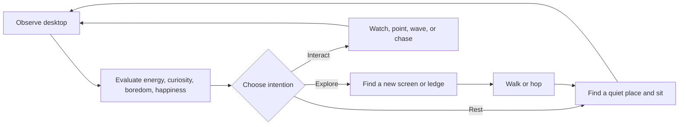

<div align="center">


# Nimvio

### Your curious desktop companions.

Nimvio walks across your Windows desktop, explores every monitor, finds places to sit, reacts to you, and develops its own rhythm through energy, curiosity, boredom, and happiness.

[](https://www.microsoft.com/windows)
[](https://dotnet.microsoft.com/)
[](https://learn.microsoft.com/dotnet/desktop/winforms/)


[Features](#features) · [Characters](#meet-the-characters) · [Installation](#installation) · [Controls](#controls) · [Build](#build-from-source) · [Privacy](#privacy)

</div>

---

## Meet the characters

<table>
  <tr>
    <td align="center" width="33%">
      
      <br /><strong>Nova</strong><br />Curious · Cyan
    </td>
    <td align="center" width="33%">
      
      <br /><strong>Mimo</strong><br />Playful · Orange
    </td>
    <td align="center" width="33%">
      
      <br /><strong>Lumi</strong><br />Calm · Purple
    </td>
  </tr>
</table>

Each character has an independent profile, color, personality, emotional state, favorite screen, and memory of recently visited places. When companions meet, they notice and wave to each other.

## Features

### A small mind, not a random animation

- **Internal needs:** energy, curiosity, boredom, and happiness influence every decision.
- **Personality:** curious, calm, and playful characters behave at different speeds and choose different actions.
- **Memory:** companions remember their latest six resting places and avoid repeating them immediately.
- **Context awareness:** eyes follow the mouse or active window, while movement considers monitors and visible window boundaries.

### Natural desktop behavior

- Walks, hops, searches, sits, points, waves, thinks, sleeps, and looks around.
- Finds desktop edges, corners, and suitable visible-window ledges.
- Travels across monitors placed beside, above, or below each other.
- Includes blinking, breathing, head tilting, sitting transitions, and dynamic shadows.
- Occasionally stumbles, becomes surprised, uses binoculars, or chases the cursor.

### Designed to stay out of the way

- Hides automatically while another application is fullscreen.
- Supports configurable quiet hours from 22:00 to 07:00.
- Lets you choose exactly which monitors companions may visit.
- Runs as a lightweight native Windows application—no Electron or embedded browser.
- Uses a custom multi-resolution character-head icon in the executable, shortcuts, and notification area.

## Installation

### Packaged release

1. Download and extract `Nimvio-Windows.zip`.
2. Double-click **`Install.cmd`**.
3. Nimvio installs to `%LOCALAPPDATA%\Nimvio` and creates a desktop shortcut.
4. Use the notification-area icon to summon characters, add a companion, or exit.

The installer safely replaces an older Nimvio version while preserving saved settings. Run `Uninstall.cmd` to remove the application.

### Requirements

- Windows 10 or Windows 11, 64-bit
- [.NET 10 Desktop Runtime](https://dotnet.microsoft.com/download/dotnet/10.0)

The .NET 10 SDK already includes the required runtime for development machines.

## Controls

| Action | Result |
| --- | --- |
| Left-click | Click the character to improve its mood |
| Left-click and drag | Pick up and move the character |
| Release after a fast drag | Throw the character and trigger a surprised reaction |
| Double-click | Pause or resume autonomous activity |
| Right-click | Open character settings |
| Double-click tray icon | Summon all characters near the mouse pointer |

## Customization

The right-click menu is entirely in English and includes:

| Setting | Options |
| --- | --- |
| Activity level | Calm, Normal, Energetic |
| Autonomy | Low, Normal, High |
| Size | Small, Medium, Large |
| Screens | Enable specific monitors or send a character to a chosen screen |
| Personality | Curious, Calm, Playful |
| Character | Nova, Mimo, Lumi |
| Color | Cyan, Orange, Green, Purple |
| Focus | Quiet hours and fullscreen hiding |
| System | Start with Windows, add/remove characters, About |

Nimvio supports up to **three active companions**.

## How decisions work



The behavior model is deterministic enough to feel coherent but includes weighted variation, so characters do not repeat the same routine on every cycle.

## Build from source

Open PowerShell in the project directory:

```powershell
dotnet restore .\Nimvio.csproj --configfile .\NuGet.Config
dotnet build .\Nimvio.csproj -c Release --no-restore
dotnet publish .\Nimvio.csproj -c Release --no-restore --no-self-contained -o .\publish
```

Run the development build:

```powershell
dotnet run --project .\Nimvio.csproj
```

## Automated GitHub releases

The workflow at `.github/workflows/build-release.yml` runs on every push to `main` and can also be started manually from the Actions tab. It:

1. Sets up .NET 10 on a Windows runner.
2. Restores, builds, and publishes Nimvio in Release mode.
3. Packages the application, installer scripts, documentation, and gallery assets as `Nimvio-Windows.zip`.
4. Uploads the ZIP as a workflow artifact for 30 days.
5. Creates a GitHub Release named `Nimvio Build #<run number>` and attaches the ZIP.

The workflow requires the repository setting **Actions → General → Workflow permissions → Read and write permissions**. The workflow also declares `contents: write`, which allows its built-in `GITHUB_TOKEN` to create the release.

## Architecture

| File | Responsibility |
| --- | --- |
| `Program.cs` | Starts the WinForms application context |
| `NimvioApplicationContext.cs` | Manages companions and the notification-area icon |
| `NimvioForm.cs` | Behavior state machine, input, animation, menus, and vector rendering |
| `NimvioMind.cs` | Energy, curiosity, boredom, and happiness model |
| `DesktopAwareness.cs` | Monitor, visible-window, active-window, and fullscreen detection |
| `NimvioSettings.cs` | Profiles, preferences, memory, persistence, and startup settings |
| `assets/nimvio.ico` | Multi-resolution Windows application icon |
| `install.ps1` / `uninstall.ps1` | Per-user installation and removal |

## Privacy

Nimvio works entirely offline. It does **not** capture screenshots, record keyboard input, collect analytics, or transmit data. Windows APIs are used only to read monitor and window rectangles and determine whether the foreground application is fullscreen.

Settings are stored locally at:

```text
%APPDATA%\Nimvio\settings.json
```

The optional startup entry is stored per user at:

```text
HKCU\Software\Microsoft\Windows\CurrentVersion\Run
```

## Project information

| | |
| --- | --- |
| Nimvio | **Your curious desktop companions** |
| Created by | **Mussab Muhaimeed** |
| Version | **26.7** |
| Technology | C# · .NET 10 · WinForms · GDI+ · Windows API |

The final **About** menu item opens a visual gallery with portraits of Nova, Mimo, and Lumi, their signature colors and personalities, plus the project credits above.

## License

No license has been selected yet. Add a `LICENSE` file before publishing if you want to define how others may use, modify, or redistribute Nimvio.

---

<div align="center">
  Built for a more playful Windows desktop.
</div>
